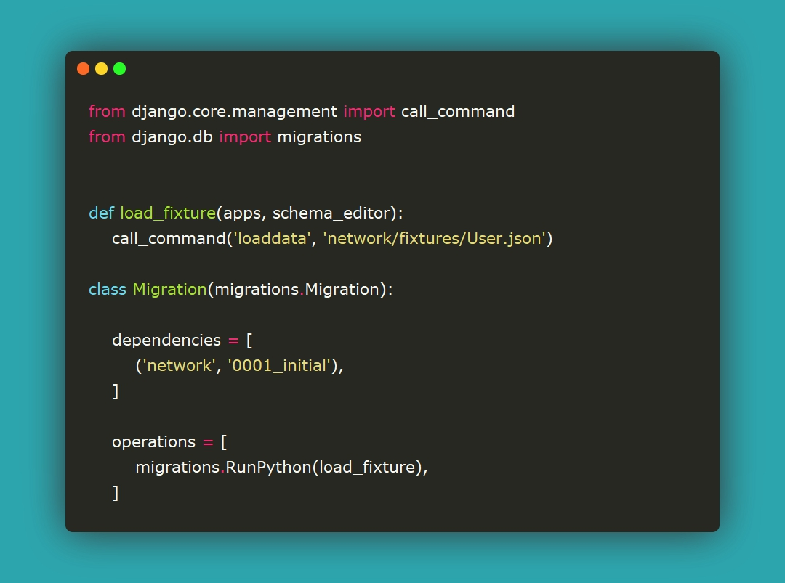

# code-converter

## Usage
`index.html` is a layout file that need to for convert to img.  
`sourcecode file` and `index.html` are need to same directory.

### How to use at command line
```
$ pip install git+https://github.com/norik00/code-convert-to-image
$ codeconvert samlpe.py
```

### Imgae of sample.py



## Library
- [pygments](https://pygments.org/])
- [BeautifulSoup](https://www.crummy.com/software/BeautifulSoup/bs4/doc/)
- [imgkit](https://pypi.org/project/imgkit/)

